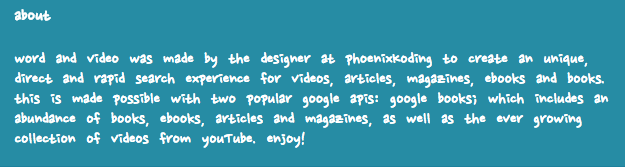

# Word And Video

*Word and Video* is a simple web application made by the designer at **phoenixKoding** to create an unique search experience for videos, articles, magazines, ebooks and books. this is made possible with two popular google apis: google books; which includes an abundance of books, ebooks, articles and magazines, as well as the ever growing collection of videos from youTube. simply enter your text into the search input and click submit to enjoy!

### Navigation Bar

###  Search

### About

### Contact

### Video Results

### Books Results

## Technologies Used
* HTML
* CSS
* JavaScript
* jQuery